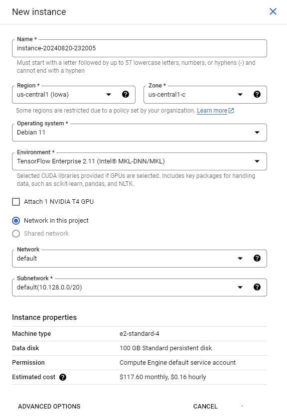
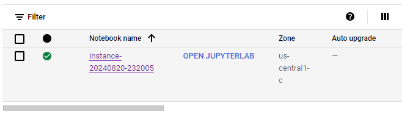
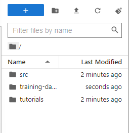

#  Vertex AI: Qwik Start #

**Activate & Authorize Cloud Shell by pressing it & wait**
1. Enable Google Cloud services
   
```bash
gcloud services enable \
  compute.googleapis.com \
  iam.googleapis.com \
  iamcredentials.googleapis.com \
  monitoring.googleapis.com \
  logging.googleapis.com \
  notebooks.googleapis.com \
  aiplatform.googleapis.com \
  bigquery.googleapis.com \
  artifactregistry.googleapis.com \
  cloudbuild.googleapis.com \
  container.googleapis.com
```

Create Vertex AI custom service account for Vertex Tensorboard integration

copy this command :

```bash
SERVICE_ACCOUNT_ID=vertex-custom-training-sa
gcloud iam service-accounts create $SERVICE_ACCOUNT_ID  \
    --description="A custom service account for Vertex custom training with Tensorboard" \
    --display-name="Vertex AI Custom Training"
```
```bash
PROJECT_ID=$(gcloud config get-value core/project)
gcloud projects add-iam-policy-binding $PROJECT_ID \
    --member=serviceAccount:$SERVICE_ACCOUNT_ID@$PROJECT_ID.iam.gserviceaccount.com \
    --role="roles/storage.admin"
```
```bash
gcloud projects add-iam-policy-binding $PROJECT_ID \
    --member=serviceAccount:$SERVICE_ACCOUNT_ID@$PROJECT_ID.iam.gserviceaccount.com \
    --role="roles/bigquery.admin"
```
```bash
gcloud projects add-iam-policy-binding $PROJECT_ID \
    --member=serviceAccount:$SERVICE_ACCOUNT_ID@$PROJECT_ID.iam.gserviceaccount.com \
    --role="roles/aiplatform.user"
```


## task 1: Create a Vertex AI Notebook ##

go to Vertex AI Workbench notebook and Create New instance.

Set Region to **us-central1** and Zone to **us-central1-c**. (each acc may be different zone or region, check on your labs)

In the New instance menu, choose the latest version of **TensorFlow Enterprise 2.11** then select **e2-standard-2** for Machine type.




Leave the remaining fields at their default and click Create.
After a few minutes, the Workbench page lists your instance, followed by Open JupyterLab.




## task 2 : Clone the lab repository ##

In JupyterLab, open a new terminal and copy this command :
```bash
git clone --depth=1 https://github.com/GoogleCloudPlatform/training-data-analyst
```
To confirm that you have cloned the repository, in the left panel, double click the training-data-analyst folder to see its contents.


