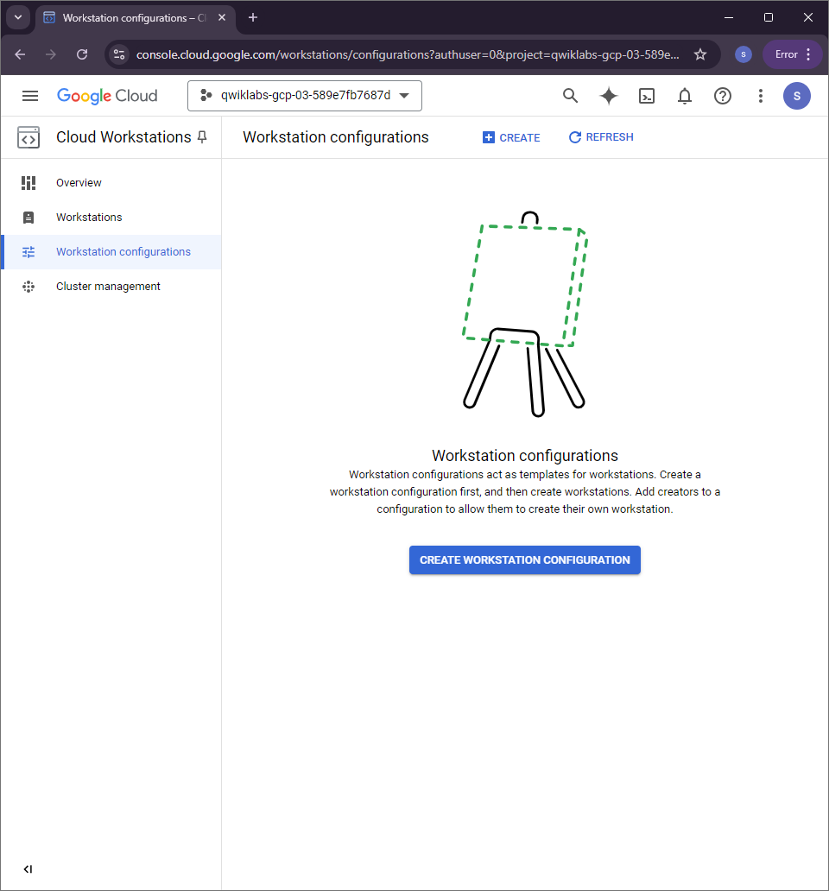
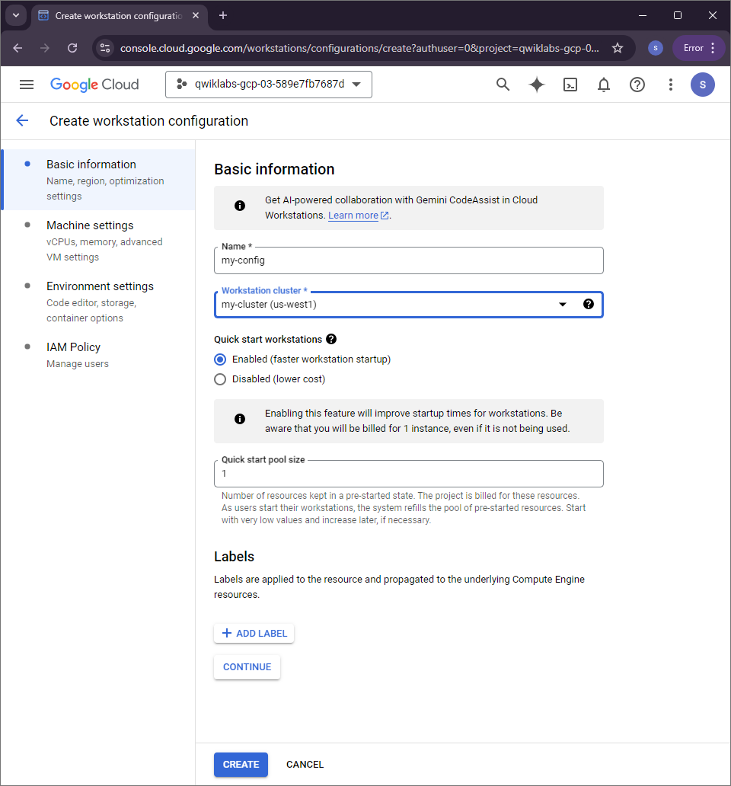
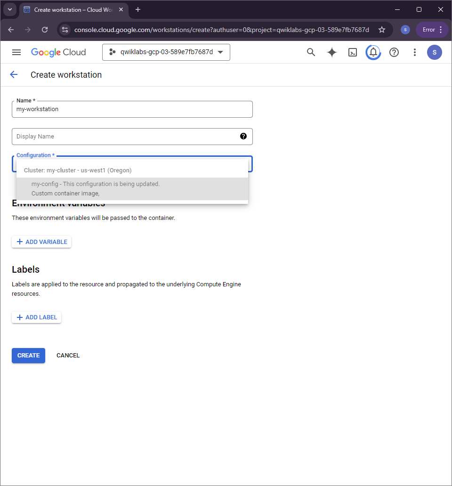
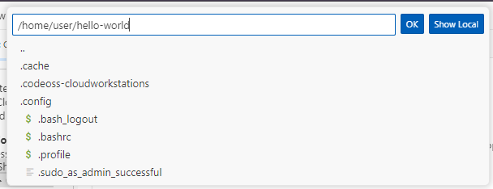
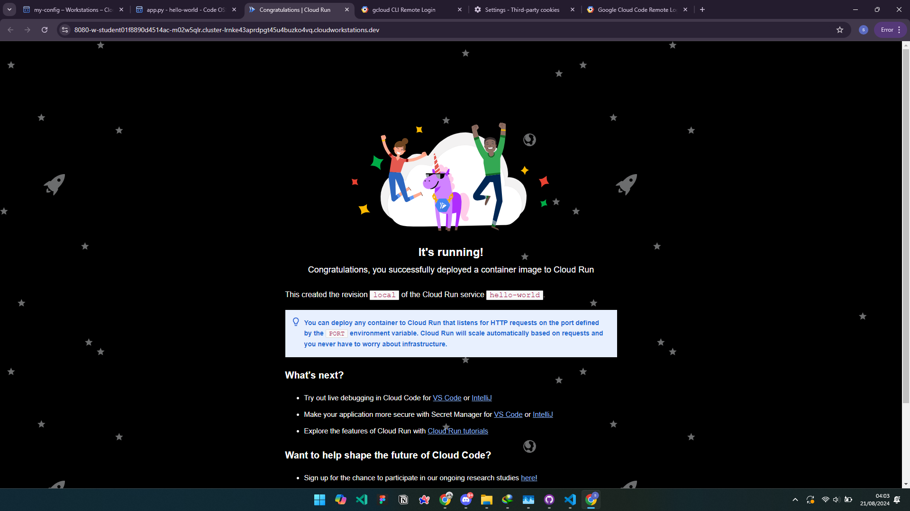

# Develop an app with Gemini #

## Task 1. Configure your environment and account

copy this command on cloud shell
```bash
PROJECT_ID=$(gcloud config get-value project)
REGION=us-west1
echo "PROJECT_ID=${PROJECT_ID}"
echo "REGION=${REGION}"
```
```bash
USER=$(gcloud config get-value account 2> /dev/null)
echo "USER=${USER}"
```
```bash
gcloud services enable cloudaicompanion.googleapis.com --project ${PROJECT_ID}
```
```bash
gcloud projects add-iam-policy-binding ${PROJECT_ID} --member user:${USER} --role=roles/cloudaicompanion.user
gcloud projects add-iam-policy-binding ${PROJECT_ID} --member user:${USER} --role=roles/serviceusage.serviceUsageViewer
```

## Task 2. Create a Cloud Workstation

go to *Tools > Cloud Workstations* and click *cluster management*


In the Navigation pane, click Workstation configurations, and then click Create Workstation Configuration.


Specify the following values:

| *Property* |	*Value* |
|-------------|-------------|
| Name | my-config |
| Workstation cluster | select my-cluster |

Create a workstation





## Task 3. Update the Cloud Code extension to enable Gemini


**Sign In to Cloud Code:**  
   - Click on **Cloud Code - Sign In** in the status bar and follow the prompts. When a link appears in the terminal, press Control (Windows/Linux) or Command (MacOS) and click it. Sign in using your student email, agree to the terms, and copy the verification code displayed in your browser.

**Authorize Cloud Code:**  
   - Return to the IDE terminal, paste the copied verification code when prompted, and press Enter. Wait until the status bar shows **Cloud Code - No Project.** You’re now connected to Google Cloud.

**Task 4: Chat with Gemini**

**Open Gemini Chat:**
   - Click **Gemini Code Assist** in the IDE activity bar. If an error occurs, refresh the browser.

**Prompt Gemini:**
   - Type and send the prompt:  
     _"I am new to Google Cloud and I want to use the Cloud Code extension. Give me some examples of Google services that I can use to build and deploy a sample app."_

**Ask for More Details:**
   - Send the follow-up prompt:  
     _"What is the difference between Cloud Run and Cloud Functions?"_

---

**Task 5: Develop a Python App**

**Create a Cloud Run App:**
   - Open the command palette and type `Cloud Code: New Application`. Select **Cloud Run application**, then **Python (Flask): Cloud Run**. Name the app and folder `/home/user/hello-world`, then click **Ok**.

   

**Explain Code with Gemini:**
   - In the Explorer pane, select the `Dockerfile`, then click the bulb icon and select **Gemini: Explain this** for the entire file or specific lines.

**Run the App Locally:**
   - In the IDE, click **Cloud Code > Cloud Run > Run App on Local Cloud Run Emulator**.
      

result: 
   


**Task 6: Enhance the Python App**

**Generate Sample Data:**
   - Create a file `inventory.py` and prompt Gemini to generate sample inventory data:  
     _"Create a variable called inventory which is a list of 3 JSON objects. Each JSON object has 2 attributes: productid and onhandqty. Both attributes are strings."_

**Add API Methods:**
   - In `app.py`, prompt Gemini to generate the code for listing inventory items and fetching a specific item by product ID. Replace the generated code with the following if necessary:

   ```python
   @app.route('/inventory', methods=['GET'])
   def inventory_list():
       """Return a list of inventory items in JSON format."""
       return jsonify(inventory)

   @app.route('/inventory/<productid>', methods=['GET'])
   def inventory_item(productid):
       """Return a single inventory item in JSON format."""
       for item in inventory:
           if item['productid'] == productid:
               return jsonify(item)
       return jsonify({'error': 'Product not found'}), 404
   ```

**Test API Methods:**
   - Run the app locally, append `/inventory` or `/inventory/{productID}` to the URL to test.


**Task 7: Deploy the App to Cloud Run**

**Deploy to Cloud Run:**
   - Open the command palette, type `Cloud Code: Deploy to Cloud Run`. Enable the Cloud Run API and deploy the app.

**Test the Deployed Service:**
   - Obtain the service URL and test the `/inventory` and `/inventory/{productID}` paths in your browser.


shortcut for the lab by [@quiccklabs](https://github.com/quiccklabs) (except for task 2):

```bash
export REGION=
```
```bash
curl -LO raw.githubusercontent.com/quiccklabs/Labs_solutions/master/Develop%20an%20app%20with%20Gemini/quicklab.sh

sudo chmod +x quicklab.sh

./quicklab.sh
```

