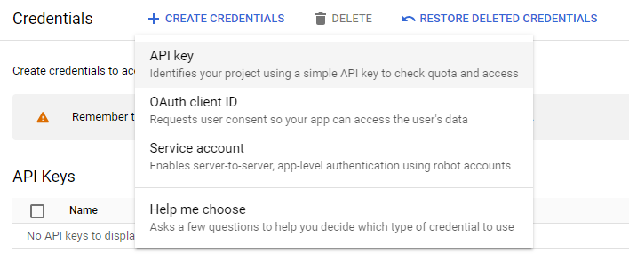

# Analyze Speech & Language with Google APIs: Challenge Lab

## Task 1. Create an API key ##

go to APIs & Services > Credentials



after creating API key, go to Compute Engine and open SSH connection.


wait till SSH connection is established


In the command line, enter in the following, replacing <YOUR_API_KEY>
```bash
export API_KEY=<YOUR_API_KEY>
```


## Task 2. Make an entity analysis request and call the Natural Language API-to-Text API request ##

open SSH and copy this command in the SSH cli:

```bash
touch nl_request.json
```
```bash
nano request.jsonnl_request.json
```
add this command to nl_request.json

```bash
{
  "document":{
    "type":"PLAIN_TEXT",
    "content":"With approximately 8.2 million people residing in Boston, the capital city of Massachusetts is one of the largest in the United States."
  },
  "encodingType":"UTF8"
}
```
Save the response in a file called nl_response.json

curl "https://language.googleapis.com/v1/documents:analyzeEntities?key=${API_KEY}" \
  -s -X POST -H "Content-Type: application/json" --data-binary @nl_request.json > nl_response.json

Press control + x and then y to save and click Enter

## Task 3. Create a speech analysis request and call the Speech API ##

copy this command in the SSH cli again

```bash
{
  "config": {
      "encoding":"FLAC",
      "languageCode": "en-US"
  },
  "audio": {
      "uri":"gs://cloud-samples-tests/speech/brooklyn.flac"
  }
}
```
```bash
curl -s -X POST -H "Content-Type: application/json" --data-binary @speech_request.json \
"https://speech.googleapis.com/v1/speech:recognize?key=${API_KEY}" > speech_result.json
```

## Task 4. Analyze sentiment with the Natural Language API ##


**Download the Sample File**

Use `gsutil` to download the `sentiment-samples.tgz` file from Google Cloud Storage:

```bash
gsutil cp gs://cloud-samples-tests/natural-language/sentiment-samples.tgz .
```

**Extract the Sample Files**

Extract the contents of the `.tgz` file:

```bash
tar -xvzf sentiment-samples.tgz
```

This should create a `reviews` directory with the sample files inside.

**Verify the Extracted Files**

Ensure that the `reviews` directory contains the expected files:

```bash
ls reviews/
```

You should see files like `bladerunner-pos.txt` in this directory.

**Run the Sentiment Analysis**

Assuming your `sentiment_analysis.py` script is correctly set up as follows:

```python
import argparse
from google.cloud import language_v1

def analyze(movie_review_filename):
    # Instantiate a LanguageServiceClient
    client = language_v1.LanguageServiceClient()

    # Read the movie review file
    with open(movie_review_filename, 'r') as review_file:
        content = review_file.read()

    # Create a Document object with the contents of the file
    document = language_v1.Document(
        content=content,
        type_=language_v1.Document.Type.PLAIN_TEXT
    )

    # Call the analyze_sentiment method on the client
    sentiment = client.analyze_sentiment(request={'document': document})

    # Output the sentiment analysis result
    print(f"Text: {content}")
    print(f"Sentiment score: {sentiment.document_sentiment.score}")
    print(f"Sentiment magnitude: {sentiment.document_sentiment.magnitude}")

if __name__ == "__main__":
    parser = argparse.ArgumentParser(
        description="Analyze sentiment of a movie review using Google Cloud Natural Language API."
    )
    parser.add_argument(
        "movie_review_filename",
        help="The filename of the movie review you'd like to analyze.",
    )
    args = parser.parse_args()
    analyze(args.movie_review_filename)
```

Run the sentiment analysis on one of the files, such as `bladerunner-pos.txt`:

```bash
python3 sentiment_analysis.py reviews/bladerunner-pos.txt
```