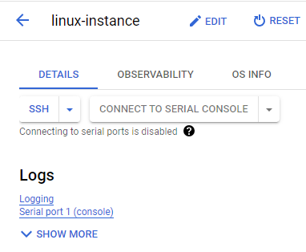

#  Speech-to-Text API Qwik Start #

## Task 1. Create an API key ##

go to APIs & Services > Credentials


after creating API key, go to Compute Engine and open SSH connection.



wait till SSH connection is established


In the command line, enter in the following, replacing <YOUR_API_KEY>
```bash
export API_KEY=<YOUR_API_KEY>
```


## Task 2. Make an entity analysis request ##

copy this command in the SSH cli:

```bash
nano request.json
```
add this command to request.json

```bash
{
  "document":{
    "type":"PLAIN_TEXT",
    "content":"Joanne Rowling, who writes under the pen names J. K. Rowling and Robert Galbraith, is a British novelist and screenwriter who wrote the Harry Potter fantasy series."
  },
  "encodingType":"UTF8"
}
```
Press control + x and then y to save and click Enter


## Task 3. Call the Natural Language API ##

Open SSH (linux-instance) on Compute Engine and copy this command in the SSH cli

```bash
curl "https://language.googleapis.com/v1/documents:analyzeEntities?key=${API_KEY}" \
  -s -X POST -H "Content-Type: application/json" --data-binary @request.json > result.json
```
check the response by running the following command
```
cat result.json
```
the result will look like this:


# Optional #
In Tasks 4 through 7, you learned various text analysis techniques using the Google Cloud Natural Language API: 

## Task 4. Sentiment analysis with the Natural Language API ##

replace the code in request.json
```bash
 {
  "document":{
    "type":"PLAIN_TEXT",
    "content":"Harry Potter is the best book. I think everyone should read it."
  },
  "encodingType": "UTF8"
}
```
Press CTRL+X to exit nano, then Y to save the file, then ENTER to confirm.

send the request to the API's analyzeSentiment endpoint
```bash
curl "https://language.googleapis.com/v1/documents:analyzeSentiment?key=${API_KEY}" \
  -s -X POST -H "Content-Type: application/json" --data-binary @request.json
```
## Task 5. Analyzing entity sentiment ##

replace the code in request.json
```bash
 {
  "document":{
    "type":"PLAIN_TEXT",
    "content":"I liked the sushi but the service was terrible."
  },
  "encodingType": "UTF8"
}
```
Press CTRL+X to exit nano, then Y to save the file, then ENTER to confirm.

call the *analyzeEntitySentiment* endpoint with curl command:
```bash
curl "https://language.googleapis.com/v1/documents:analyzeEntitySentiment?key=${API_KEY}" \
  -s -X POST -H "Content-Type: application/json" --data-binary @request.json
```

## Task 6. Analyzing syntax and parts of speech ##

replace the code in request.json with nano

```bash
{
  "document":{
    "type":"PLAIN_TEXT",
    "content": "Joanne Rowling is a British novelist, screenwriter and film producer."
  },
  "encodingType": "UTF8"
}
```

save and call the *analyzeSyntax* with curl command:

```bash
curl "https://language.googleapis.com/v1/documents:analyzeSyntax?key=${API_KEY}" \
  -s -X POST -H "Content-Type: application/json" --data-binary @request.json
```

### Task 7. Multilingual natural language processing ##

modify the code in requset.json again

```bash
{
  "document":{
    "type":"PLAIN_TEXT",
    "content":"日本のグーグルのオフィスは、東京の六本木ヒルズにあります"
  }
}
```
save and call the *analyzeSyntax* with curl command:
```bash
curl "https://language.googleapis.com/v1/documents:analyzeEntities?key=${API_KEY}" \
  -s -X POST -H "Content-Type: application/json" --data-binary @request.json
```


