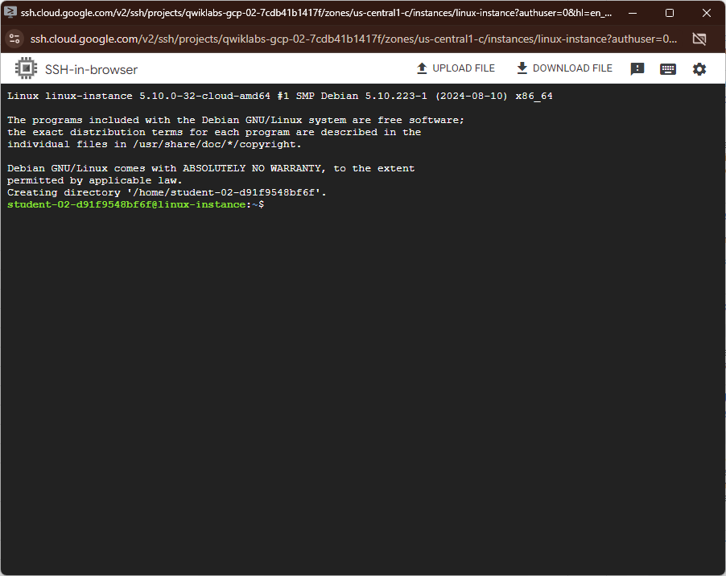

#  Speech-to-Text API Qwik Start #

## Task 1. Create an API key ##

go to APIs & Services > Credentials


after creating API key, go to Compute Engine and open SSH connection.


wait till SSH connection is established



In the command line, enter in the following, replacing <YOUR_API_KEY>
```bash
export API_KEY=<YOUR_API_KEY>
```


## Task 2. Create your API request ##

copy this command in the SSH cli:

```bash
nano request.json
```
add this command to request.json

```bash
{
  "config": {
      "encoding":"FLAC",
      "languageCode": "en-US"
  },
  "audio": {
      "uri":"gs://cloud-samples-data/speech/brooklyn_bridge.flac"
  }
}

```
Press control + x and then y to save and click Enter


## Task 3. Call the Speech-to-Text API ##


```bash
curl -s -X POST -H "Content-Type: application/json" --data-binary @request.json \
"https://speech.googleapis.com/v1/speech:recognize?key=${API_KEY}" > result.json

```
check the response by running the following command
```
cat result.json
```
 

## Task 4. Speech-to-Text transcription in different languages ##

replace the code in request.json
```bash
 {
  "config": {
      "encoding":"FLAC",
      "languageCode": "fr"
  },
  "audio": {
      "uri":"gs://cloud-samples-data/speech/corbeau_renard.flac"
  }
}

```
Press CTRL+X to exit nano, then Y to save the file, then ENTER to confirm.

send the request to the API's
```bash
curl -s -X POST -H "Content-Type: application/json" --data-binary @request.json \
"https://speech.googleapis.com/v1/speech:recognize?key=${API_KEY}" > result.json
```
check the response by running the following command
```
cat result.json
```


