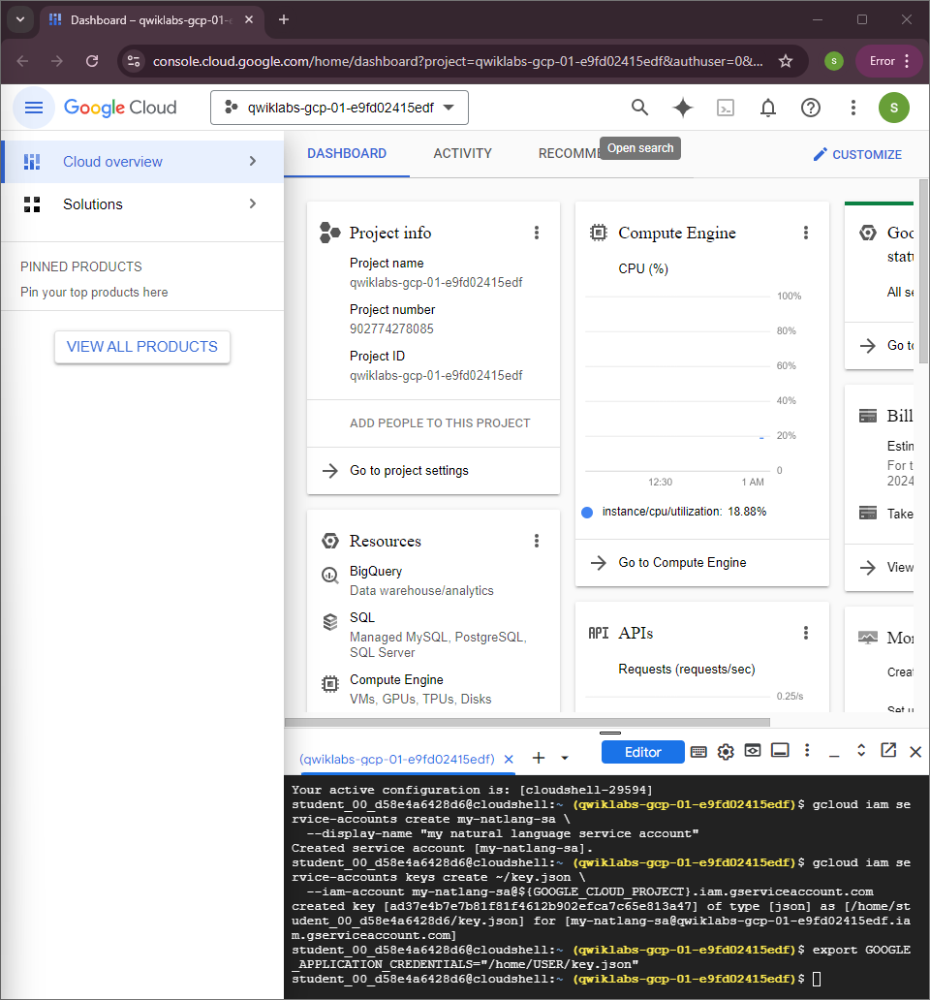
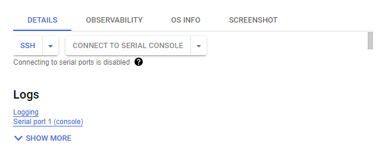
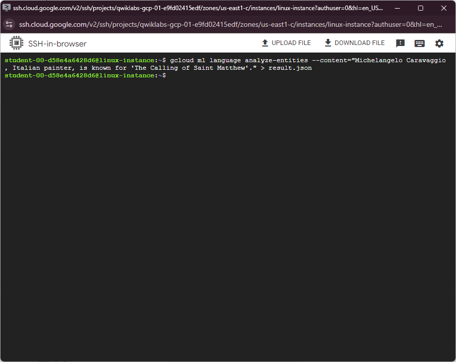
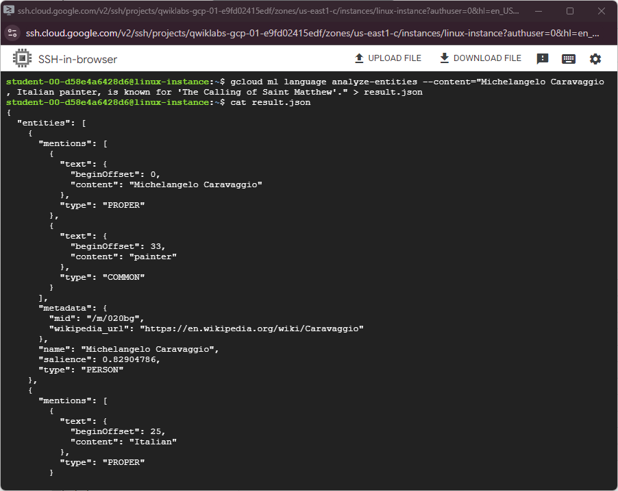

#  Cloud Natural Language API: Qwik Start #

## Task 1. Create an API key ##

activate and authorize your cloud shell then copy this command


```bash
export GOOGLE_CLOUD_PROJECT=$(gcloud config get-value core/project)
```
```bash
gcloud iam service-accounts create my-natlang-sa \
  --display-name "my natural language service account"
```
```bash
gcloud iam service-accounts keys create ~/key.json \
  --iam-account my-natlang-sa@${GOOGLE_CLOUD_PROJECT}.iam.gserviceaccount.com
```
```bash
export GOOGLE_APPLICATION_CREDENTIALS="/home/USER/key.json"
```




## Task 2. Make an entity analysis request ##

go to *compute engine* and open linux-instance
click on the SSH button



wait till SSH open



copy this command in the SSH cli:

```bash
touch request.json
```
```bash
nano request.json
```
add this command to request.json

```bash
{
  "config": {
      "encoding":"FLAC",
      "languageCode": "en-US"
  },
  "audio": {
      "uri":"gs://cloud-samples-tests/speech/brooklyn.flac"
  }
}
```
Press control + x and then y to save and click Enter

copy this command in the SSH cli again

```bash
curl -s -X POST -H "Content-Type: application/json" --data-binary @request.json \
"https://speech.googleapis.com/v1/speech:recognize?key=${API_KEY}"
```
```
curl -s -X POST -H "Content-Type: application/json" --data-binary @request.json \
"https://speech.googleapis.com/v1/speech:recognize?key=${API_KEY}" > result.json
```

result will look like this:



